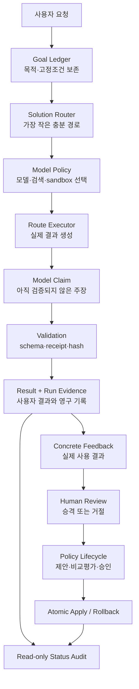

# PSOS Master

이 파일은 Personal Problem-Solving OS 저장소의 최상위 마스터 문서다.

사람과 AI는 이 파일 하나를 읽고 다음 질문에 답할 수 있어야 한다.

1. 무엇을 해결하려고 이 시스템을 만들었는가?
2. 그 목적 때문에 구체적으로 무엇을 만들었는가?
3. 각 구성요소는 어떤 원리로 연결되는가?
4. AI의 결과를 어디까지 신뢰하고 어떻게 검증하는가?
5. 파일 변경과 정책 변경을 어떻게 안전하게 통제하는가?
6. 현재 무엇이 완성됐고 무엇이 남아 있는가?
7. 다음 AI나 개발자는 어디부터 읽고 무엇을 함께 수정해야 하는가?

상세한 필드 규격과 변경 계약은
[`specs/PSOS_SYSTEM_BLUEPRINT.md`](specs/PSOS_SYSTEM_BLUEPRINT.md)에 있다. 하지만 이 마스터
파일은 다른 문서를 열지 않아도 전체 목적과 구조를 이해할 수 있도록 자립적으로 작성한다.

## 1. 한 문장 정의

> PSOS는 사용자가 원하는 최종 목적을 보존한 채 가장 작은 충분 해결 방법을 자동으로
> 선택하고, 실제 실행 결과를 증거로 검증하며, 검토된 현실 결과만 정책 학습에 반영하는
> 개인 문제해결 운영체제다.

프롬프트 생성은 이 시스템의 한 기능일 뿐이다. 목표를 직접 해결하는 답변, 조사, 기존 자산
재사용, 프롬프트, 코드, 장기 프로젝트 중 무엇이 적합한지를 시스템이 먼저 판단한다.

## 2. 왜 만들었는가

이 시스템은 사용자가 해결하고 싶은 결과는 알고 있지만 해결 방식까지 설계하기는 어려운
상황을 위해 만들었다.

기존 AI 작업에서 반복되는 문제는 다음과 같았다.

- 사용자가 검색·프롬프트·코드·프로젝트 중 무엇을 써야 하는지 먼저 결정해야 했다.
- 작업이 길어지면 원래 목적보다 중간 작업 자체가 더 중요해졌다.
- AI가 실제로 하지 않은 일을 완료했다고 표현할 수 있었다.
- 파일 변경 권한이 너무 넓거나 실패 후 작업 공간이 불완전하게 남을 수 있었다.
- “좋아”, “계속”, “ㄱㄱ” 같은 약한 반응이 성공 신호로 오해될 수 있었다.
- AI가 자신의 결과를 평가하고 자신의 정책을 바꾸면 오류가 강화될 수 있었다.
- 실행 기록이 쌓여도 현재 상태와 다음 안전 행동을 알기 어려웠다.

따라서 상위 목적은 단순히 더 좋은 프롬프트를 만드는 것이 아니다.

```text
사용자의 목적 보존
  + 해결 방식 자동 선택
  + 실제 결과 생산
  + 독립적인 실행 검증
  + 안전한 변경과 복구
  + 현실 증거에 기반한 통제된 학습
```

## 3. 어떤 목적 때문에 무엇을 만들었는가

| 목적 또는 막으려는 실패 | 그 때문에 만든 것 | 실제 효과 | 확인할 증거 |
|---|---|---|---|
| 긴 작업에서도 사용자의 원래 목적을 잃지 않기 | Goal Ledger | 현재 단계가 상위 목적과 계속 연결됨 | `request.txt`, `goal_ledger.json` |
| 사용자가 기술적 해결 방법을 먼저 고르지 않게 하기 | 7개 경로 Solution Router | 시스템이 가장 작은 충분 경로를 선택함 | `route.json` |
| 작업 난도에 맞는 모델과 최소 권한을 쓰기 | Luna·Terra·Sol Model Policy | 라우팅·경량 실행·복잡 실행을 분리함 | `problem-solving-project/model-policy.json` |
| 계획을 반복하지 않고 실제 결과를 만들기 | Route Executor와 명시적 종료 상태 | 완료·부분·차단·인계를 구분함 | `result.md`, `route.json` |
| AI의 완료 주장을 그대로 믿지 않기 | JSON 스키마·validator·receipt·hash | 모델 주장과 외부 현실을 독립적으로 비교함 | 실행 출력, 각종 receipt |
| 기존 자산을 새로 만든 것처럼 주장하지 않기 | REUSE 자산 fingerprint | 실제 로컬 파일이나 폴더를 확인함 | `<stage>-reuse-receipt.json` |
| 파일을 유용하게 바꾸되 넓은 권한을 주지 않기 | 경로별 승인·백업·변경 receipt·자동 rollback | 승인 범위 밖 변화와 삭제를 거부하고 복구함 | 승인·백업·receipt·rollback 파일 |
| 약한 반응이나 자기평가로 정책이 오염되지 않게 하기 | feedback→review→proposal→evaluation→approval→apply | 현실 증거와 사람 권한을 모두 통과해야 학습됨 | 학습·정책 생명주기 기록 |
| 손상·중단·정책 drift를 발견하기 | 읽기 전용 status audit | 현재 건강 상태와 다음 안전 행동을 보여줌 | `scripts/problem_solving_status.py` |
| 비개발자도 사용할 수 있게 하기 | 로컬 PSOS 작업실 UI | 자연어 요청, 승인, 결과, 증거를 한 화면에서 다룸 | `scripts/problem_solving_web.py`, `web/` |
| 다음 AI가 구조를 재추측하지 않게 하기 | 이 마스터 문서와 상세 설계도 | 목적·책임·변경 규칙을 빠르게 복원함 | `PSOS_MASTER.md`, 상세 설계도 |

## 4. 결국 만들어진 것은 무엇인가

PSOS는 다음 네 층으로 이루어진 하나의 시스템이다.

### 4.1 실행 커널

자연어 요청을 받아 목표를 고정하고 경로와 모델을 선택한 뒤 실제 실행 결과를 만든다.

- 핵심: `scripts/problem_solving_os.py`
- 입력: 일반 언어 요청, 선택적 문맥, 검색 또는 쓰기 권한
- 출력: 결과와 영구 실행 기록

### 4.2 로컬 작업 화면

사용자가 명령어를 몰라도 요청하고 결과·증거·현재 상태를 볼 수 있는 로컬 전용 화면이다.

- 서버: `scripts/problem_solving_web.py`
- 화면: `web/index.html`, `web/app.js`, `web/styles.css`
- 기본 모드: 읽기 전용
- 파일 변경: 범위 입력 후 별도 승인

### 4.3 증거 시스템

모델이 말한 것과 실제로 일어난 일을 구분한다.

- 구조 검증: JSON schema
- 실행 검증: artifact, evidence, receipt
- 상태 검증: 파일 hash와 before/after snapshot
- 장기 기록: `runs/<run-id>/`

### 4.4 통제된 학습 루프

현실 결과에서 배우되 AI가 스스로 정책을 오염시키지 못하게 한다.

- 구체적 결과 기록
- 사람의 승격 또는 거절
- 독립 근거 기반 정책 제안
- 기존 정책과 후보 정책의 쌍 비교
- 별도 사람 승인
- 원자적 적용과 rollback

## 5. 전체 구조



핵심 신뢰 원리는 다음 한 문장이다.

> 모델은 경로·결과·파일 변경·정책 변경을 제안할 수 있지만 자신의 주장을 스스로
> 증명하거나 승인할 수는 없다.

## 6. 해결 경로와 모델 역할

### 6.1 해결 경로

| 경로 | 선택 목적 |
|---|---|
| `DIRECT` | 현재 문맥만으로 설명·분석·초안 등 직접 결과를 만들 수 있음 |
| `RESEARCH` | 최신 사실, 실제 존재 여부, 사양, 정책, 근거가 결과를 바꿈 |
| `REUSE` | 기존 로컬 도구·템플릿·방법론을 사용하는 것이 새 제작보다 나음 |
| `PROMPT` | 다른 AI나 환경에서 반복 실행할 지시문 자체가 필요함 |
| `CODE` | 반복성·대량 처리·재현성·정확성을 위해 코드가 필요함 |
| `PROJECT` | 여러 단계·파일·세션에 걸친 상태 유지가 실제로 필요함 |
| `HYBRID` | 하나의 경로로 부족해 서로 다른 두 경로를 순서대로 사용함 |

`HYBRID`는 복잡성을 무한히 늘리지 않도록 구체 경로 두 개까지만 허용한다.

### 6.2 모델 배정

| 단계 | 모델 | 이유 |
|---|---|---|
| 기본 라우터 | `gpt-5.6-luna`, low | 실행하지 않고 빠르게 경로만 판단 |
| 라우터 fallback | `gpt-5.6-sol`, medium | Luna의 구조화 결과가 유효하지 않을 때 한 번 복구 |
| DIRECT | `gpt-5.6-terra`, low | 가벼운 직접 작업 |
| REUSE | `gpt-5.6-terra`, medium | 기존 자산 읽기·적용 |
| RESEARCH | `gpt-5.6-sol`, medium | 검색 근거와 복합 판단 |
| PROMPT | `gpt-5.6-sol`, medium | baseline을 바탕으로 재사용 가능한 최종 지시 작성 |
| CODE·PROJECT | `gpt-5.6-sol`, high | 복잡한 구현·검증·장기 상태 작업 |

실제 배정은 설명문이 아니라
[`problem-solving-project/model-policy.json`](problem-solving-project/model-policy.json)이
결정한다.

## 7. 한 요청이 처리되는 방식

```text
1. 요청 원문을 저장한다.
2. Goal Ledger로 상위 목적·고정 조건·현재 단계를 만든다.
3. Router가 가장 작은 충분 경로를 선택한다.
4. Runtime capability와 Model Policy를 확인한다.
5. 해당 Route Executor가 결과를 만든다.
6. JSON 구조와 경로별 완료 조건을 검증한다.
7. 자산 또는 파일 변경 주장이 있으면 receipt로 현실을 검사한다.
8. 통과한 결과와 실행 증거를 run 디렉터리에 저장한다.
9. 실제 사용 결과가 생기면 별도 feedback으로 기록한다.
```

실행 엔진을 사용할 수 없으면 경로를 추측하지 않고 차단 상태를 기록한다. 검색이 필요한데
검색 capability가 없거나 쓰기 권한이 필요한데 승인되지 않았다면 완료했다고 표현하지 않는다.

## 8. Goal Ledger가 하는 일

Goal Ledger는 긴 작업에서 방향이 흔들리는 것을 막는 상태 기록이다.

필수 개념:

- 상위 목적
- 현재 목표 가설
- 반드시 보존할 조건
- 현재 위치
- 선택 경로
- 현재 단계
- 이 단계가 필요한 이유
- 단계 완료 조건
- 결과를 바꾸는 핵심 불확실성 최대 3개

하위 작업이 상위 목적의 어떤 실패를 막거나 어떤 결과를 만드는지 설명할 수 없으면 그 작업은
중단하거나 보류해야 한다.

## 9. AI 결과를 검증하는 방식

PSOS에서 모델 출력은 기본적으로 `untrusted claim`이다.

| 모델의 주장 | 독립 검증 |
|---|---|
| 올바른 경로를 골랐다 | route schema와 Goal Ledger 일치 검사 |
| 실행을 완료했다 | execution schema와 경로별 완료 조건 |
| 기존 자산을 확인했다 | 실제 경로 해석과 fingerprint |
| 파일을 만들거나 수정했다 | before/after workspace receipt |
| 허용된 범위만 바꿨다 | approved scope와 실제 변화 비교 |
| 정책 후보가 더 낫다 | 별도 paired evaluation |
| 정책을 적용했다 | before/after hash, backup, change receipt |

따라서 `result.md`는 사용자 결과이고, `route.json`과 각종 receipt는 그 결과를 신뢰할 수 있는
근거다.

## 10. 안전한 파일 변경 설계

로컬 웹 UI와 CLI의 파일 변경은 단순 권한 토글이 아니다.

```text
파일 변경 모드 선택
  → 저장소 상대 경로 입력
  → 정확한 요청·작업 공간·경로를 다시 표시
  → 한 번만 유효한 명시 승인
  → tracked·untracked·Git-ignored 파일 snapshot과 backup
  → 모델 실행
  → 실제 파일 변화 검증
  → 성공 또는 자동 rollback
```

승인할 수 없는 범위:

- 저장소 전체 `.`
- `.git`
- `runs`
- 절대 경로
- 작업 공간 밖으로 나가는 `..` 경로

실패 조건:

- 승인 범위 밖 파일 변화
- 결과에 보고되지 않은 변화
- 파일 삭제
- 모델 프로세스 실패
- 구조화 출력 누락 또는 오류
- receipt 불일치

실패하면 생성 파일을 제거하고 수정·삭제 파일을 백업에서 복원한 뒤, 전체 파일 snapshot이
실행 전과 같은지 다시 검사한다. rollback까지 검증되지 않으면 복구됐다고 주장하지 않는다.

CLI에서는 다음 두 조건이 반드시 함께 있어야 한다.

```powershell
--allow-workspace-write `
--write-scope <저장소-상대-경로>
```

여러 범위는 `--write-scope`를 반복한다. CLI 승인은 요청 hash·작업 공간·정규화된 경로와
결합되고, 실제 쓰기 단계가 실행되면 `cli-write-approval.json`으로 남는다. 웹과 CLI는 같은
경로 validator, backup, receipt, 삭제 금지, 범위 밖 변경 거절, 자동 rollback을 사용한다.

## 11. 실행 증거와 저장 구조

최소 실행 기록:

```text
runs/<run-id>/
  request.txt
  goal_ledger.json
  route.json
  result.md
```

상황에 따라 추가되는 증거:

```text
<stage>-request.md
<stage>-output.json
<stage>.log
<stage>-reuse-receipt.json
<stage>-workspace-backup/
<stage>-workspace-receipt.json
<stage>-workspace-rollback.json
web-write-approval.json
learning_record.json
learning_review.json
```

`runs`는 rollback 대상에서 제외한다. 실패한 변경을 복구하더라도 실패 원인과 복구 증거는
남아야 하기 때문이다.

## 12. 학습과 정책 변경 설계


강한 학습 신호:

- 실제 채택
- 구체적 정정
- 명시적 거절
- 실행 성공 또는 실패 확인
- 잘못된 경로 지적

단독으로 성공 증거가 아닌 것:

- 좋아
- ㅇㅇ
- 계속
- ㄱㄱ

정책이 실제로 바뀌려면 다음 조건을 모두 통과해야 한다.

```text
현실 결과
AND 불변 증거
AND 사람 검토
AND 독립적인 복수 근거
AND 기존 정책과 후보 정책의 쌍 비교
AND 별도 사람 승인
AND backup과 hash가 있는 원자적 적용
```

## 13. 주요 파일 지도

| 파일 또는 폴더 | 역할 |
|---|---|
| `PSOS_MASTER.md` | 저장소 전체 목적·구성·현재 상태를 설명하는 최상위 입구 |
| `specs/PSOS_SYSTEM_BLUEPRINT.md` | AI용 상세 규범 설계와 변경 계약 |
| `problem-solving-project/INSTRUCTIONS.md` | 행동 원칙과 라우팅 철학 |
| `problem-solving-project/model-policy.json` | 실제 모델·effort·검색·sandbox 정책 |
| `schemas/problem-solving-os-route.schema.json` | Goal Ledger와 route 출력 계약 |
| `schemas/problem-solving-os-execution.schema.json` | 실행 결과·artifact·evidence 계약 |
| `scripts/problem_solving_os.py` | 핵심 실행 커널 |
| `scripts/problem_solving_web.py` | 로컬 UI 서버와 승인 API |
| `web/` | 사용자 화면 |
| `scripts/problem_solving_feedback.py` | 실제 결과 학습 기록 |
| `scripts/problem_solving_review.py` | 사람 검토 |
| `scripts/problem_solving_policy_proposal.py` | 정책 후보 생성 |
| `scripts/problem_solving_policy_evaluation.py` | 기존·후보 정책 비교 |
| `scripts/problem_solving_policy_change.py` | 승인·적용·rollback |
| `scripts/problem_solving_status.py` | 전체 생명주기 읽기 전용 감사 |
| `tests/` | 안전 계약과 회귀 검증 |

## 14. 현재 구현 상태

2026-07-30 검증 기준:

- Luna → Terra/Sol 모델 라우팅 실행 가능
- DIRECT·RESEARCH·REUSE·PROMPT·CODE·PROJECT·HYBRID 지원
- Goal Ledger와 영구 run evidence 저장
- REUSE asset receipt 지원
- CODE·PROJECT workspace receipt 지원
- 웹 UI의 범위별 파일 변경 승인과 자동 rollback 지원
- CLI의 반복 가능한 `--write-scope` 승인과 `cli-write-approval.json` 증거 지원
- 실제 feedback과 수동 review 지원
- 정책 proposal·paired evaluation·approval·apply·rollback 지원
- 전체 상태 audit와 로컬 UI 지원
- 159개 자동 테스트 통과
- 6개 route smoke test 통과
- 저장된 실행 18/18 무결성 정상

이 숫자는 영구 상수가 아니다. 최신 상태는 다음 명령으로 다시 확인한다.

```powershell
python -B -m unittest discover -s tests
python -B tests/smoke_problem_solving_os.py
python -B scripts/problem_solving_status.py
```

## 15. 현재 한계

- 안전 백업은 Git-ignored 파일까지 모두 복사하므로 매우 큰 저장소에서는 비용이 커질 수 있다.
- rollback은 파일 내용을 검증하지만 빈 디렉터리는 추적하지 않는다.
- 웹 job과 pending approval은 서버 메모리에 있어 서버 재시작 후 실행 핸들은 사라진다.
- 정책 생명주기 전체를 조작하는 사용자 UI는 아직 없다.
- 브라우저 QA에서 실제 모델 파일 변경은 승인하지 않았고 transaction 테스트로 검증했다.

## 16. AI가 이 저장소를 읽는 순서

1. `PSOS_MASTER.md`
2. `specs/PSOS_SYSTEM_BLUEPRINT.md`
3. `problem-solving-project/model-policy.json`
4. 두 JSON schema
5. 변경하려는 기능의 focused script
6. 같은 기능의 tests

문서가 충돌할 때:

1. schema와 active model policy로 선언 계약을 확인한다.
2. executable validator와 transaction code로 실제 동작을 확인한다.
3. tests로 반드시 보존할 안전 의도를 확인한다.
4. 마스터와 상세 설계도를 함께 고친다.
5. 사용자 설명만 바꾸고 실행 계약을 그대로 두지 않는다.

## 17. AI가 기능을 바꿀 때 지켜야 할 것

새 route를 추가하면 함께 검토할 것:

- route 상수
- route schema
- model policy
- router와 executor prompt
- validator
- model plan과 run serialization
- single·hybrid tests
- 마스터와 상세 설계도

실행 결과 필드를 바꾸면 함께 검토할 것:

- execution schema
- validator
- run 기록
- 웹 API와 UI 표시
- status audit
- 과거 기록 호환성

파일 변경 기능을 바꾸면 반드시 검증할 것:

- 안전한 상대 경로
- 전체·보호·외부 경로 거절
- 허용 변화
- 범위 밖 생성
- 수정·삭제 rollback
- Git-ignored 파일
- 승인·receipt·rollback 증거

학습이나 정책을 바꾸면 반드시 보존할 것:

- 과거 기록 불변성
- hash anchor
- review와 proposal 분리
- evaluation과 approval 분리
- apply 전 backup
- stale policy 거절
- rollback 가능성

## 18. 완료의 정의

PSOS에서 “완료”는 모델이 완료했다고 말하는 상태가 아니다.

```text
사용자의 원래 목적이 보존됨
AND 선택 경로가 충분하고 과도하지 않음
AND 필요한 capability가 실제로 사용 가능함
AND 결과 구조가 유효함
AND 실행 또는 자산 주장이 증거와 일치함
AND 파일 변경이 승인 범위와 일치함
AND 한계와 미실행 부분이 숨겨지지 않음
```

정책 변경의 완료는 여기에 사람 검토, 독립 근거, 비교 평가, 별도 승인, 원자적 적용 검증까지
추가되어야 한다.

## 19. 다음 우선순위

1. 대형 저장소용 증분 또는 content-addressed backup
2. 빈 디렉터리 rollback 추적
3. 서버 재시작 후 job·approval 복구
4. 검토된 정책 생명주기 관리 UI

우선순위는 기능 수를 늘리는 순서가 아니다. 현재 신뢰 경계를 다른 진입점에도 동일하게
적용하는 순서다.

## 20. 최종 요약

어떤 목적으로 인해 무엇을 만들었는가:

```text
사용자가 방법을 몰라도 목적만 말하면 되게 하려고
  → Goal Ledger, Router, Model Policy, Route Executor를 만들었다.

AI가 말한 완료와 실제 완료를 구분하려고
  → schema, validator, evidence, receipt, hash를 만들었다.

파일을 바꿀 수 있으면서도 넓게 신뢰하지 않으려고
  → scoped approval, backup, verification, rollback을 만들었다.

현실 결과에서 배우되 스스로 오류를 강화하지 않게 하려고
  → feedback, human review, proposal, paired evaluation,
    approval, atomic apply/rollback 생명주기를 만들었다.

사람과 다음 AI가 현재 상태를 이해하고 이어서 작업하게 하려고
  → status audit, local web workspace, master file, detailed blueprint를 만들었다.
```

따라서 PSOS는 프롬프트 모음이 아니다.

> 사용자의 목적을 중심으로 판단·실행·검증·복구·학습을 연결한 개인 문제해결 운영체제다.
