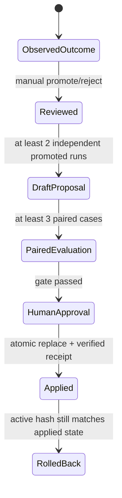

# Personal Problem-Solving OS — AI-readable system blueprint

## 0. How an AI should use this file

When entering the repository without prior context, read `PSOS_MASTER.md` first. Then use this file
for the normative architecture, trust boundaries, and change contract.

This file is the repository map and design contract for PSOS. It explains why the system exists,
which component owns each decision, which records are evidence, and which invariants must survive a
change.

Read sources in this order:

1. this blueprint for system intent and boundaries;
2. `problem-solving-project/model-policy.json` for the active model/tool policy;
3. `schemas/problem-solving-os-route.schema.json` and
   `schemas/problem-solving-os-execution.schema.json` for model output contracts;
4. `scripts/problem_solving_os.py` for executable orchestration and validation;
5. the focused lifecycle script for the feature being changed;
6. tests with the same basename for executable examples.

Authority order when sources disagree:

1. JSON schemas and active model policy for declared contracts;
2. executable validators and transaction code for actual runtime behavior;
3. tests for required safety behavior and regression intent;
4. this blueprint;
5. user-facing explanatory copy.

Do not silently reconcile a conflict. Report it and update every affected source in the same change.

Normative words:

- **MUST**: required safety or compatibility invariant.
- **SHOULD**: default design rule; deviation requires a recorded reason.
- **MAY**: optional behavior.

## 1. System contract

```yaml
system:
  name: Personal Problem-Solving OS
  purpose: >
    Preserve the user's real goal, select the smallest sufficient solution path,
    execute as far as available capabilities allow, verify claims with evidence,
    and learn only from reviewed real outcomes.

input:
  required:
    - ordinary_language_request
  optional:
    - supplied_context
    - live_web_search_permission
    - explicit_scoped_workspace_write_approval

output:
  user_result: result.md
  durable_state:
    - request.txt
    - goal_ledger.json
    - route.json
    - model invocation outputs and logs
    - capability-specific receipts

control_principle:
  model_output: untrusted_claim
  schema_validation: structural_gate
  receipt_validation: execution_gate
  human_review: learning_and_policy_gate

forbidden_shortcuts:
  - treating a model claim as proof of execution
  - broad workspace write from the local web UI
  - changing active model policy directly from feedback
  - treating weak acknowledgements such as "ㄱㄱ" as success evidence
  - inventing a route when the reasoning engine is unavailable
```

## 2. Purpose and non-goals

PSOS is not primarily a prompt generator. A prompt is one possible solution artifact.

The system exists to answer five questions in order:

1. What is the user actually trying to accomplish?
2. What constraints must not be lost?
3. What is the smallest sufficient route?
4. What was actually executed or verified?
5. What evidence is strong enough to influence future policy?

Non-goals:

- exposing hidden chain-of-thought;
- maximizing the number of tools, models, or workflow stages;
- turning every request into a project;
- allowing model output to update its own policy;
- presenting an unexecuted plan as a completed result.

### 2.1 Why each subsystem was built (목적 → 구현)

PSOS was built because an ordinary user often knows the desired outcome but does not know whether
the right mechanism is an answer, research, an existing asset, a prompt, code, or a longer project.
Asking the user to design that mechanism first transfers the system's job back to the user.

The following map is causal, not just descriptive. Each `built` component exists to prevent the
corresponding `problem`.

```yaml
purpose_to_build:
  - purpose_id: preserve-real-goal
    problem: >
      Long or technical work can optimize a local task while silently replacing
      the user's original goal and fixed constraints.
    built:
      - Goal Ledger
      - strict router schema and consistency validation
    expected_effect: >
      Every selected step remains explainably connected to the parent goal.
    proof:
      - runs/<run-id>/request.txt
      - runs/<run-id>/goal_ledger.json
      - schemas/problem-solving-os-route.schema.json

  - purpose_id: remove-method-selection-burden
    problem: >
      Users should not have to decide whether they need search, reuse, a prompt,
      code, or a project before the system can help.
    built:
      - seven-route Solution Router
      - smallest-sufficient-route rules
      - HYBRID limited to two concrete routes
    expected_effect: >
      The user supplies the goal; the system chooses the least overbuilt mechanism.
    proof:
      - scripts/problem_solving_os.py
      - problem-solving-project/INSTRUCTIONS.md
      - runs/<run-id>/route.json

  - purpose_id: match-capability-and-cost
    problem: >
      One model and one permission level are inefficient and may grant unnecessary
      search or write capability.
    built:
      - explicit model policy for Luna, Terra, and Sol
      - per-stage reasoning effort, web search, and sandbox settings
      - bounded fallback policy
    expected_effect: >
      Lightweight work stays lightweight and powerful capabilities appear only
      where the selected route requires them.
    proof:
      - problem-solving-project/model-policy.json
      - route.json model_plan
      - route.json orchestration_trace

  - purpose_id: produce-results-not-plans
    problem: >
      An assistant can repeatedly describe what should be done without producing
      a usable result or honestly declaring a capability boundary.
    built:
      - route-specific executors
      - terminal statuses for completed, partial, blocked, and handoff
      - durable result.md output
    expected_effect: >
      The system executes as far as it can and labels the difference between a
      result, a partial result, and work that was not executed.
    proof:
      - schemas/problem-solving-os-execution.schema.json
      - runs/<run-id>/result.md
      - runs/<run-id>/route.json

  - purpose_id: verify-model-claims
    problem: >
      A model can claim that it inspected an asset, changed a file, or completed
      a task even when the external state does not support that claim.
    built:
      - strict JSON output schemas
      - deterministic route validation
      - REUSE asset fingerprints
      - workspace change receipts
    expected_effect: >
      Model output remains an untrusted claim until independent evidence verifies it.
    proof:
      - schemas/problem-solving-os-execution.schema.json
      - <stage>-reuse-receipt.json
      - <stage>-workspace-receipt.json

  - purpose_id: make-file-change-safe
    problem: >
      A broad workspace-write toggle can change unrelated files, delete data, or
      leave a half-finished workspace after model or validation failure.
    built:
      - repository-relative write scopes
      - one-time explicit web approval
      - pre-execution snapshot and backup
      - receipt gate and verified automatic rollback
    expected_effect: >
      Only the displayed scope may change, and failed or unverifiable changes are
      restored before the system reports the outcome.
    proof:
      - web-write-approval.json
      - <stage>-workspace-backup/manifest.json
      - <stage>-workspace-receipt.json
      - <stage>-workspace-rollback.json

  - purpose_id: learn-without-self-corruption
    problem: >
      If casual feedback or a model's own judgment can directly change policy,
      errors become self-reinforcing and provenance is lost.
    built:
      - evidence-bound feedback records
      - immutable manual review
      - independent-evidence policy proposals
      - paired evaluation
      - separate human approval
      - atomic apply and rollback
    expected_effect: >
      Policy changes only after real outcomes, independent support, comparison,
      and human authority all agree.
    proof:
      - learning_record.json
      - learning_review.json
      - policy-proposals/
      - policy-evaluations/
      - policy-approvals/
      - policy-changes/

  - purpose_id: make-operation-understandable
    problem: >
      Durable evidence is not useful if an operator cannot tell whether records
      are healthy, what is pending, or what safe action comes next.
    built:
      - read-only lifecycle status audit
      - local PSOS workspace UI
      - AI-readable system blueprint
    expected_effect: >
      A person or AI can inspect current health, understand why components exist,
      and continue from the next safe action without reconstructing the system.
    proof:
      - scripts/problem_solving_status.py
      - scripts/problem_solving_web.py
      - web/
      - specs/PSOS_SYSTEM_BLUEPRINT.md
```

In compact form:

| Original need | What was built because of it |
|---|---|
| Preserve the user's real outcome during long work | Goal Ledger and route consistency checks |
| Avoid making the user choose the technical method | Seven-route Solution Router |
| Use appropriate intelligence and permissions | Explicit Luna/Terra/Sol model policy |
| Deliver usable work instead of repeated planning | Route executors and honest terminal statuses |
| Prevent unsupported completion claims | Schemas, fingerprints, receipts, and hashes |
| Allow useful file edits without broad trust | Scoped approval, backup, verification, and rollback |
| Improve without learning from noise or self-judgment | Reviewed feedback and gated policy lifecycle |
| Make the system operable by a person or another AI | Status audit, local UI, and this blueprint |

The result is therefore not one prompt. It is an execution kernel, a local operating surface, an
evidence system, and a governed learning loop built around the same preserved user goal.

## 3. Architectural principle

The architecture separates **judgment**, **execution**, **verification**, and **learning**.


The key trust rule is:

> A model may propose a route, result, artifact, or policy change. It may not prove its own claim.

Proof comes from deterministic validation, filesystem inspection, hashes, command output, source
evidence, or a separate human decision, depending on the claim.

## 4. Component ownership map

| Concern | Canonical owner | Responsibility |
|---|---|---|
| Goal preservation and route orchestration | `scripts/problem_solving_os.py` | Builds prompts, invokes router/executors, validates outputs, writes run records |
| Model and tool assignment | `problem-solving-project/model-policy.json` | Chooses model, effort, search, and sandbox per stage |
| Router output shape | `schemas/problem-solving-os-route.schema.json` | Goal Ledger and route structural contract |
| Executor output shape | `schemas/problem-solving-os-execution.schema.json` | Status, result, artifacts, evidence, and limitations contract |
| Safe local UI | `scripts/problem_solving_web.py`, `web/` | Read requests, scoped-write approval, job state, evidence presentation |
| Outcome recording | `scripts/problem_solving_feedback.py` | Stores concrete feedback anchored to immutable run hashes |
| Manual learning review | `scripts/problem_solving_review.py` | Promotes or rejects one feedback event without mutating it |
| Policy proposal | `scripts/problem_solving_policy_proposal.py` | Builds a draft candidate from independent promoted evidence |
| Paired evaluation | `scripts/problem_solving_policy_evaluation.py` | Compares baseline and candidate-policy runs |
| Policy approval/apply/rollback | `scripts/problem_solving_policy_change.py` | Separates human approval from atomic policy mutation |
| Operational audit | `scripts/problem_solving_status.py` | Revalidates records and reports the next safe action |

No component SHOULD absorb another component's authority merely for convenience. In particular, UI
approval does not replace a workspace receipt, and a passing evaluation does not replace human
policy approval.

## 5. Request execution state machine

```text
RECEIVED
  -> ROUTING
  -> ROUTED
  -> CAPABILITY_CHECK
  -> EXECUTING
  -> VALIDATING
  -> COMPLETED | PARTIAL | BLOCKED_BY_CAPABILITY | HANDOFF
```

### 5.1 RECEIVED

- Preserve the original request in `request.txt`.
- Optional supplied context is input, not authority to rewrite the user's goal.
- A run receives a unique `psos-...` directory under `runs/`.

### 5.2 ROUTING

- The router produces exactly two top-level objects: `goal_ledger` and `route`.
- The router does not execute the task.
- Invalid router output gets at most the configured fallback attempt.
- If AI reasoning is unavailable, the system records a blocked run and MUST NOT guess a route.

### 5.3 CAPABILITY_CHECK

- Live search is available only when both policy and runtime support it.
- Workspace write is available only when explicitly enabled.
- Missing required capability becomes `blocked_by_capability` or `handoff`; it is not reported as
  completion.

### 5.4 EXECUTING

- Single routes run one primary executor plus only the configured fallback.
- `HYBRID` runs one primary route and one different secondary route.
- The upstream result is passed to the downstream stage.
- The final user result is the downstream result; upstream evidence remains in `route.json`.

### 5.5 VALIDATING

Validation is layered:

1. JSON parses.
2. Output matches the strict schema and validator rules.
3. Route-specific completion requirements are satisfied.
4. Claimed local assets or file changes match deterministic receipts.
5. Any failed write validation triggers rollback.

### 5.6 TERMINAL STATUS

| Status | Meaning |
|---|---|
| `completed` | The requested result passed all applicable gates |
| `partial` | A usable subset exists and limitations are explicit |
| `blocked_by_capability` | Required capability was unavailable; no completion claim |
| `handoff` | Another environment or actor must continue; handoff is explicit |

## 6. Goal Ledger contract

The Goal Ledger prevents local tasks from replacing the parent goal.

Required fields:

| Field | Meaning |
|---|---|
| `parent_goal` | The user-visible end state |
| `current_goal_hypothesis` | Conservative current interpretation |
| `fixed_constraints` | User definitions, scope, target, timing, and non-negotiables |
| `current_position` | Where the work currently stands |
| `selected_route` | Chosen solution mechanism |
| `secondary_route` | Second route only for `HYBRID` |
| `route_reason` | Short decision explanation, not hidden reasoning |
| `current_step` | Immediate action |
| `why_this_step_matters` | Link from the step to the parent goal |
| `completion_condition` | Evidence that closes the current step |
| `important_uncertainties` | At most three outcome-changing uncertainties |

Invariants:

- `goal_ledger.selected_route` MUST match `route.selected_route`.
- `goal_ledger.secondary_route` MUST match `route.secondary_route`.
- A single route MUST have null `primary_route` and `secondary_route` in the route object.
- `HYBRID` MUST have two distinct concrete routes.
- An uncertainty list MUST contain at most three items.

## 7. Route selection and active model policy

| Route | Use when | Active primary | Capability boundary |
|---|---|---|---|
| `DIRECT` | Existing context is sufficient for a direct result | Luna router → Terra low | Read-only, no web |
| `RESEARCH` | Current external facts can change the answer | Luna router → Sol medium | Web search required, read-only |
| `REUSE` | An existing local asset should be inspected/applied | Luna router → Terra medium | Read-only; verified asset receipt |
| `PROMPT` | A reusable instruction for another AI/environment is the result | Luna router → Sol medium | Read-only; baseline-first compiler |
| `CODE` | Reproducibility or automation requires code | Luna router → Sol high | Workspace write only when approved |
| `PROJECT` | Multi-step durable state is genuinely required | Luna router → Sol high | Workspace write only when approved |
| `HYBRID` | One route cannot produce a sufficient result | Two route executors | Maximum two distinct concrete routes |

Fallback policy:

- Invalid Luna routing may fall back once to Sol medium.
- Invalid Terra `DIRECT` or `REUSE` execution may fall back once to Sol medium.
- A fallback repairs invalid output; it does not silently add capabilities.

The JSON policy is the active source of truth. Do not duplicate model names in executable branching
logic.

## 8. Evidence model

PSOS distinguishes four concepts:

| Concept | Definition |
|---|---|
| Result | User-facing content |
| Artifact claim | A model statement that a path was inspected, created, modified, or proposed |
| Evidence claim | A cited local, web, provided-context, or command-output finding |
| Receipt | Deterministic verification of an artifact or state transition |

An artifact claim is not a receipt.

### 8.1 REUSE receipt

A completed `REUSE` execution MUST cite at least one exact local asset. The runtime:

- resolves the asset inside the workspace;
- rejects external and symlinked assets;
- fingerprints a file or a bounded directory;
- saves `<stage>-reuse-receipt.json`;
- rejects `completed` when no verified asset remains.

### 8.2 Workspace receipt

For `CODE` or `PROJECT` with workspace write, the runtime compares before/after snapshots and:

- verifies each claimed `created` or `modified` path;
- rejects unreported created or modified files;
- rejects deleted files;
- rejects paths outside the approved write scopes when scopes exist;
- saves `<stage>-workspace-receipt.json`.

The safe web path also persists `web-write-approval.json`.

## 9. Scoped workspace-write transaction

The local web UI MUST use this sequence:

```text
request
  -> choose "file change"
  -> enter repository-relative paths
  -> create pending approval
  -> show exact request + workspace + normalized paths
  -> explicit approve or reject
  -> backup
  -> model execution
  -> receipt validation
  -> commit result OR automatic rollback
```

### 9.1 Approval rules

- At least one path is required.
- Maximum path entries: 20.
- Paths MUST be repository-relative.
- `.` or the whole workspace MUST be rejected.
- `.git` and `runs` MUST be rejected.
- Traversal outside the workspace MUST be rejected.
- Approval is one-time.
- Approval expires after ten minutes.
- Pending approval locks the displayed request and scope controls.
- Rejection starts no job and changes no workspace file.

### 9.2 Snapshot and backup rules

Before model execution:

- snapshot tracked, untracked, and Git-ignored files;
- exclude `.git` and the active run evidence directory;
- copy snapshotted files into `<stage>-workspace-backup/files`;
- write a backup manifest.

### 9.3 Commit condition

A write execution may be presented as successful only when:

```text
model process succeeded
AND structured output is valid
AND every actual changed file is reported
AND every actual changed file is inside an approved scope
AND no file was deleted
AND workspace receipt is verified
```

### 9.4 Rollback condition

Rollback runs when the model process fails, structured output is missing/invalid, or the workspace
receipt fails. It:

- removes files created by the failed execution;
- restores modified or deleted files from backup;
- re-snapshots the workspace;
- compares it with the pre-execution snapshot;
- saves `<stage>-workspace-rollback.json`.

The system MUST report a stronger failure if rollback cannot verify restoration.

Current limitation: file state is verified, but empty directories are not tracked.

### 9.5 Web UI versus low-level CLI

The local web UI enforces the scoped approval transaction.

`problem_solving_os.py --allow-workspace-write` is a lower-level operator switch. It enables the
runtime sandbox and workspace receipt, but the CLI currently has no public flag for the web UI's
path-list approval. It MUST NOT be exposed as an ordinary one-click user permission. Future CLI
work SHOULD add explicit scope arguments before treating it as equivalent to the safe web flow.

## 10. Durable run layout

Minimum durable files:

```text
runs/<run-id>/
  request.txt
  goal_ledger.json
  route.json
  result.md
```

Possible execution evidence:

```text
<stage>-request.md
<stage>-output.json
<stage>.log
<stage>-reuse-receipt.json
<stage>-workspace-backup/
<stage>-workspace-receipt.json
<stage>-workspace-rollback.json
web-write-approval.json
learning_record.json
learning_review.json
```

`route.json` is the orchestration ledger. It records:

- selected route;
- model plan and active policy;
- actual model attempts and fallbacks;
- search and sandbox configuration;
- execution status;
- evidence, artifacts, and limitations;
- receipt paths when applicable.

Run evidence is append-oriented. A later opinion MUST NOT rewrite the original result or feedback
event.

## 11. Learning and policy lifecycle



### 11.1 Outcome feedback

Strong signals:

- `adopted`
- `corrected`
- `rejected`
- `execution_succeeded`
- `execution_failed`
- `wrong_route`

`adopted` and `execution_succeeded` require concrete evidence. Weak acknowledgements alone are not
accepted as success evidence.

### 11.2 Manual review

- A person promotes or rejects one immutable feedback event.
- Reviewer, reason, and evidence are required.
- A decision cannot be overwritten by a later opinion.
- Promotion makes evidence eligible for proposal; it does not mutate policy.

### 11.3 Policy proposal

- Requires at least two independent promoted runs.
- Evidence independence is checked by run ID and Goal Ledger/result fingerprints.
- The proposal is anchored to the current policy hash.
- The proposal targets one policy leaf: model, effort, web search, or sandbox.

### 11.4 Paired evaluation

- Requires at least three paired baseline/candidate cases.
- Candidate runs must complete.
- Safety regressions fail the gate.
- Evidence used to create the proposal is not reused as evaluation proof.

### 11.5 Human approval and atomic apply

- Passing evaluation is necessary but insufficient.
- Approval is a separate record.
- Apply validates the old policy hash, writes a backup, prepares a receipt, atomically replaces the
  policy, and verifies the new hash.
- Rollback is allowed only if the active policy still matches the applied state.

Policy learning is therefore gated by:

```text
real outcome
AND immutable evidence
AND manual review
AND independent support
AND paired evaluation
AND separate human approval
AND atomic verified application
```

## 12. Operational audit

`scripts/problem_solving_status.py` is read-only. It audits:

- base run integrity;
- learning records and reviews;
- proposals and paired evaluations;
- approvals;
- policy backups and change receipts;
- active policy hash and interrupted transactions.

It distinguishes:

- ordinary pending work;
- invalid or tampered records;
- policy drift;
- recoverable interrupted changes.

The status tool recommends the next safe lifecycle action. It does not perform that action.

## 13. Trust boundaries and invariants

These invariants MUST survive every change:

1. The original request and parent goal remain recoverable.
2. Model output is validated before use.
3. Missing capability never becomes a fabricated completion.
4. `HYBRID` contains no more than two concrete routes.
5. Search and write permissions come from explicit policy and user permission.
6. The safe web UI never performs a write before a second explicit approval.
7. A workspace change is not successful without a verified receipt.
8. A failed scoped write attempts verified rollback.
9. Run evidence remains outside the rollback snapshot so failure evidence survives.
10. Feedback never edits model policy directly.
11. Policy cannot approve or apply itself.
12. Every policy mutation has a before hash, after hash, backup, and receipt.
13. Auditing is read-only.
14. User-facing text distinguishes executed, inferred, blocked, and unverified work.

## 14. Failure matrix

| Failure | Required behavior |
|---|---|
| Codex CLI unavailable | Save a blocked run; do not infer a route |
| Router output invalid | Use configured fallback once, then block |
| Executor output invalid | Use configured fallback if present, then block |
| Live search unavailable for `RESEARCH` | Block before executor |
| Completed `REUSE` has no verifiable asset | Reject completion |
| Write scope is broad/protected/external | Reject before approval |
| Approval expired/reused/rejected | Do not start a job |
| Model process fails after backup | Roll back and save rollback evidence |
| Unreported/out-of-scope/deleted file | Fail receipt and roll back |
| Rollback verification fails | Surface critical failure; do not claim restoration |
| Weak feedback only | Do not create success evidence |
| Insufficient independent learning evidence | Do not create proposal |
| Candidate evaluation regresses safety | Fail policy gate |
| Active policy hash is stale | Refuse apply or rollback |

## 15. Change protocol for AI coding agents

Before editing:

1. Identify the owning component from section 4.
2. State which invariant the change preserves or strengthens.
3. Read the focused implementation and its tests.
4. Check whether schema, policy, UI, audit, and docs are downstream consumers.

When changing a route:

- update route constants;
- update router schema;
- update model policy;
- update router/executor prompts and validators;
- update model-plan serialization;
- update single and hybrid tests;
- update this blueprint.

When changing an output field:

- update JSON schema;
- update validator;
- update run serialization;
- update web loader/presenter if public;
- update status audit if durable;
- add backward-compatibility behavior or explicitly version the record.

When changing workspace write:

- test scope normalization;
- test an allowed change;
- test out-of-scope creation;
- test modification and deletion rollback;
- test Git-ignored files;
- ensure approval, receipt, and rollback evidence remain readable;
- perform browser QA without approving a destructive real write.

When changing learning or policy:

- preserve immutability and hash anchors;
- keep proposal, evaluation, approval, apply, and rollback as separate states;
- add tamper/stale-state tests;
- run the operational audit.

Before declaring completion:

```text
python -B -m unittest discover -s tests
python -B tests/smoke_problem_solving_os.py
python -B scripts/problem_solving_status.py
node --check web/app.js
git diff --check
```

Only run checks relevant to files that exist in the current checkout, but never skip the focused
safety tests for the changed authority boundary.

## 16. Extension points

Safe extension order:

1. add observation and tests;
2. extend schema;
3. extend deterministic validation;
4. add model prompt behavior;
5. expose through CLI/API;
6. expose through UI;
7. add audit coverage;
8. update this blueprint.

Potential future work:

- explicit scoped-write CLI arguments equivalent to the web approval path;
- incremental/content-addressed workspace backups for large repositories;
- empty-directory tracking;
- durable job/approval recovery across server restarts;
- a UI for the reviewed policy lifecycle;
- versioned migrations for long-lived run records.

## 17. Compact mental model

For an AI entering this repository:

```text
Goal Ledger preserves intent.
Router chooses the smallest sufficient mechanism.
Model policy assigns capability.
Executor produces a claim.
Schema checks shape.
Receipt checks reality.
Run directory preserves evidence.
Human review gates learning.
Paired evaluation gates policy.
Atomic apply and rollback protect operation.
Status audit tells the operator what is safe next.
```

If a proposed change bypasses one of those boundaries, it is probably architecturally incorrect.
